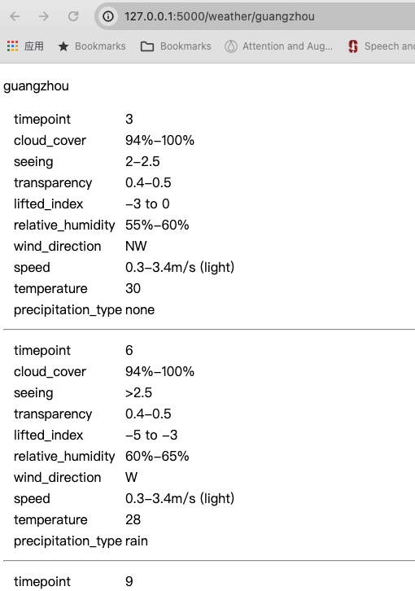

# Weather API


## Start this application
Run app with 

```bash
FLASK_DEBUG=1 flask run
```

Visit website in browser with:

http://127.0.0.1:5000/weather/guangzhou.

## Screenshot

The website looks like this:


